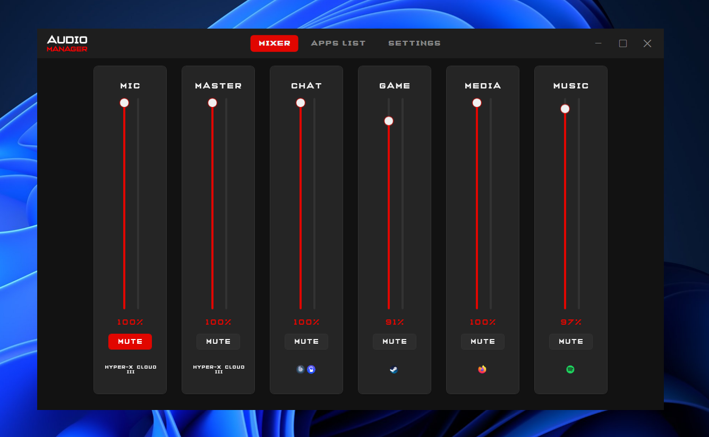
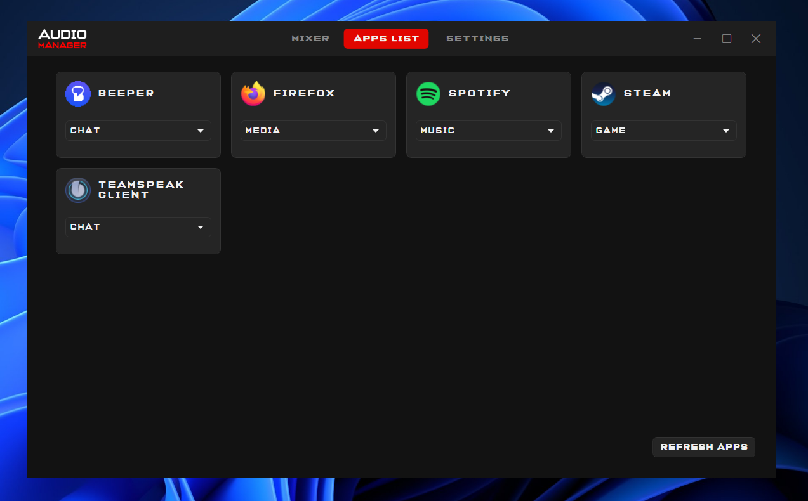
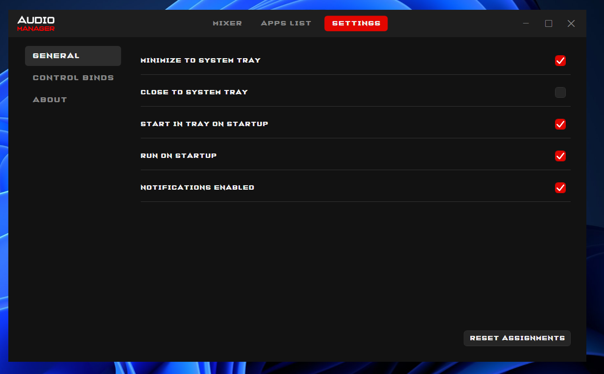
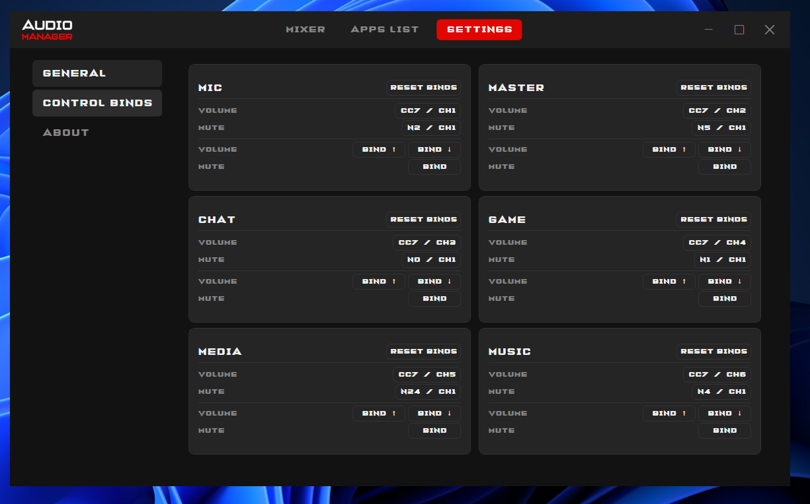

# Audio Manager

Audio Manager is a Windows desktop mixer for people who want fast control over app volume, microphone mute, and master output without opening the Windows volume mixer.

It is designed around MIDI controllers, keyboard hotkeys, tray usage, and a compact dark UI.

## Screenshots










## Features

- Control microphone, master output, and grouped app channels from one window.
- Assign running apps to mixer channels such as chat, game, media, and music.
- Control volume and mute from MIDI controllers.
- Bind keyboard shortcuts for mute and volume changes.
- Show optional on-screen notifications for hardware volume and mute changes.
- Run in the system tray.
- Start with Windows.
- Persist app assignments, bindings, tray settings, and notification settings.

## Download

Download the latest installer from the GitHub Releases page:

https://github.com/BrainAlaw/AudioManager/releases

Run `AudioManager-Setup-<version>.exe`. The installer places the app in:

```text
C:\Program Files\Audio Manager
```

It also creates a Start Menu shortcut and can optionally create a desktop shortcut.

## Basic Usage

1. Launch Audio Manager.
2. Open the `Apps List` tab.
3. Start audio in the apps you want to control.
4. Assign each app to a channel.
5. Return to the `Mixer` tab.
6. Use the sliders, mute buttons, MIDI controller, or hotkeys.

Microphone and master output follow the current Windows default devices. App channels control assigned application sessions.

## MIDI and Hotkeys

Open `Settings` and use the learn buttons to bind:

- volume control
- mute control
- keyboard mute
- keyboard volume up/down

Audio Manager works best with MIDI devices that expose knobs or buttons as standard MIDI CC or note messages.

## Notifications

Screen notifications can be disabled in:

```text
Settings -> General -> Notifications enabled
```

This only affects on-screen popups. MIDI, keyboard bindings, tray behavior, volume control, and mute control continue to work normally.

## Settings Location

User settings are stored in:

```text
%APPDATA%\AudioManager\settings.json
```

Deleting this file resets the app configuration on the next launch.

## Requirements

- Windows 10 or Windows 11
- x64 PC
- Standard Windows audio devices

The release installer is self-contained, so the .NET runtime does not need to be installed separately.

## Technical Documentation

Developer notes, architecture details, build commands, and release instructions are in [documentation.md](documentation.md).
