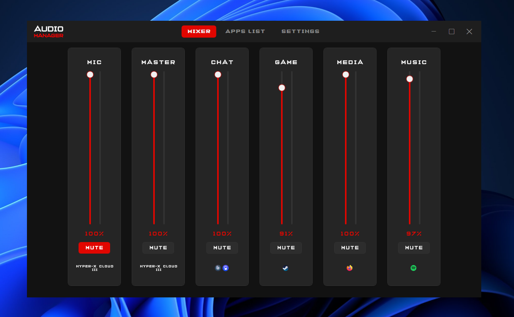
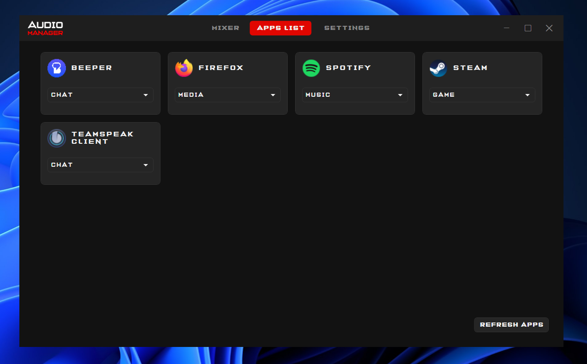
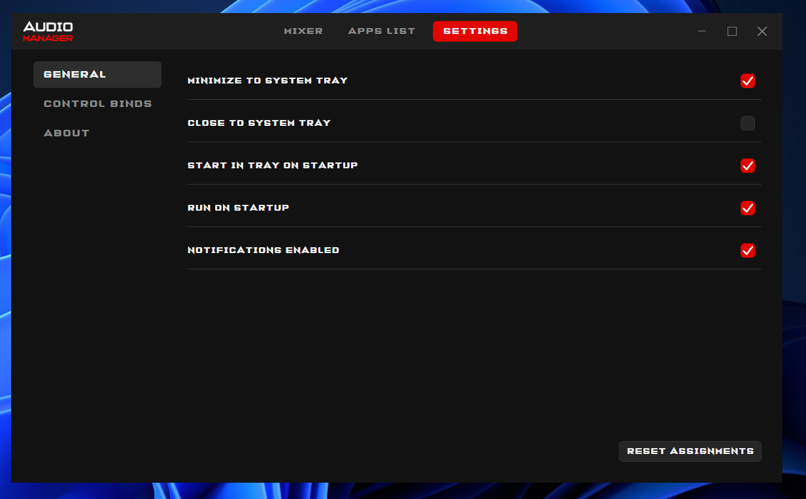
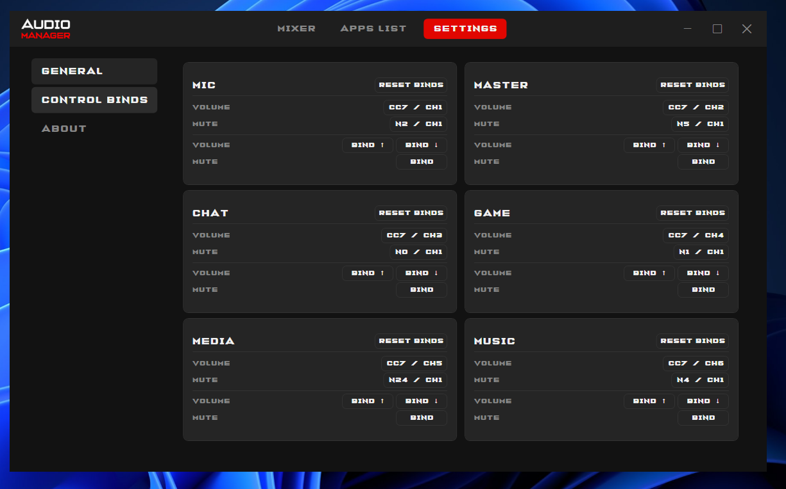

# Audio Manager

Audio Manager is a Windows desktop mixer for people who want fast control over app volume, microphone mute, and master output without opening the Windows volume mixer.

It is designed around MIDI controllers, keyboard hotkeys, tray usage, and a compact dark UI.

Current release: `1.0.3`.

## Screenshots










## Features

- Control microphone, master output, and grouped app channels from one window.
- Assign running apps to mixer channels such as chat, game, media, and music.
- Keep assigned apps visible even when they are not currently running.
- Show assigned apps as compact mixer chips with friendly-name tooltips and overflow handling.
- Control volume and mute from MIDI controllers.
- Automatically listen to available MIDI input devices.
- Bind keyboard shortcuts for mute and volume changes.
- Show optional on-screen notifications for hardware volume and mute changes.
- Display microphone, master, and app-group peak meters.
- Run in the system tray.
- Start with Windows.
- Persist app assignments, bindings, tray settings, and notification settings.

## Download

Download the latest installer from the GitHub Releases page:

https://github.com/BrainAlaw/AudioManager/releases

Run `AudioManager-Setup-<version>.exe`. The installer places the app in:

```text
C:\Program Files\Audio Manager
```

It also creates a Start Menu shortcut and can optionally create a desktop shortcut.

## Basic Usage

1. Launch Audio Manager.
2. Open the `Apps List` tab.
3. Start audio in the apps you want to control.
4. Assign each app to a channel.
5. Return to the `Mixer` tab.
6. Use the sliders, mute buttons, MIDI controller, or hotkeys.

Microphone and master output follow the current Windows default devices. App channels control assigned application sessions.

Audio Manager does not require virtual audio cables for app grouping. Apps are assigned by process name and controlled through Windows audio sessions.

## MIDI and Hotkeys

Open `Settings` and use the learn buttons to bind:

- volume control
- mute control
- keyboard mute
- keyboard volume up/down

Audio Manager works best with MIDI devices that expose knobs or buttons as standard MIDI CC or note messages.

MIDI input is auto-connected across available input devices. Manual device selection is not required for normal use.

## Notifications

Screen notifications can be disabled in:

```text
Settings -> General -> Notifications enabled
```

This only affects on-screen popups. MIDI, keyboard bindings, tray behavior, volume control, and mute control continue to work normally.

## Settings Location

User settings are stored in:

```text
%APPDATA%\AudioManager\settings.json
```

Settings are saved after changes; volume and mute updates use a 500 ms debounce. Application exit does not write settings.

Writes use a temporary file on the same volume, flush it to disk, and atomically replace `settings.json`. The previous configuration is kept in `settings.json.bak`. If the main file cannot be read, the backup is restored and the failed file is preserved as `settings.json.corrupt.<id>`. If neither file can be read, startup shows an error instead of saving defaults.

To reset the configuration, close the app and move both `settings.json` and `settings.json.bak` to a separate backup folder before launching again.

Run the focused settings regression checks with `dotnet run --project tests/SettingsRegression/SettingsRegression.csproj`.

## Requirements

- Windows 10 or Windows 11
- x64 PC
- Standard Windows audio devices

The release installer is self-contained, so the .NET runtime does not need to be installed separately.

## Technical Documentation

Developer notes, architecture details, build commands, and release instructions are in [documentation.md](documentation.md).
